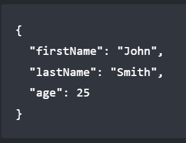

<h1> README and Markdown </h1>

The [README](https://docs.github.com/en/repositories/managing-your-repositorys-settings-and-features/customizing-your-repository/about-readmes) file is supposed to be the main point of introduction to any repository. Its purpose is to provide brief summary of the purpose of the project, specifications, rules, necessary resources, basic use guides, etc. Putting the README.md in your root or docs directory will automatically be recognized by GitHub and will be shown to anyone who visits the repository. For all documents, including README files, commit messages and issues, GitHub uses Markdown for formatting. If you check the resources on writing READMEs (like [this one](https://www.freecodecamp.org/news/how-to-write-a-good-readme-file/)) you will see that its contents are supposed to be very similar to what we ask of you for your project proposal. It is a good practice as a collaborative developer to keep such information about your project in an easily accessible place, such as the file that will automatically be displayed for your project. 

- Bonus resource: [Make README](https://www.makeareadme.com/)

### Important Elements
|Element|Markdown Syntax| Example |
|-|-|-|
|Heading| # H1 <br> ## H2 <br> ### H3 <br> etc...| <h1>Heading 1</h1> <h2> Heading 2 </h2>  <h3> Heading 3 </h3>|
|Bold |	\*\*bold text** | **bold text** |
|Italic	|\*italicized text\*| *italics* |
|Blockquote	|> blockquote| <blockquote>blockquote</blockquote>
|Ordered List|1. First item <br> 2. Second item <br>3. Third item| <ol><li>First item</li><li>Second item</li><li>Third item</li></ol>
|Unordered List	| - First item <br> - Second item <br> - Third item|<ul><li>First item</li><li>Second item</li><li>Third item</li></ul>
|Code	|\`code`|`code`|
|Horizontal Rule	|---| <hr>|
|Link	|\[title](https://www.example.com)|[title](https://www.example.com)
|Image	|!\[alt text](image.jpg)| |
Table	| \| Syntax \| Description \| <br> \| - \| - \| <br> \| Header \| Title \| <br> \| Paragraph \| Text \| | <table><tr><th>Syntax</th><th>Description</th></tr><tr><td>Header</td> <td>Title</td></tr><tr><td>Paragraph</td><td>Text</td></tr></table> |
Fenced Code Block	| \```<br>{<br>  "firstName": "John", <br>  "lastName": "Smith", <br>  "age": 25 <br>} <br> \``` |  |
Footnote	| Here's a sentence with a footnote. [\^1] <br> [\^1]: This is the footnote.| Here's a sentence with a footnote. <sup style="font-size: smaller;">[[1]]()</sup> <br> 1. This is the footnote.

### Important Note on ToC

To include the Table of Contents, you can use links:

	\[link](www.example.com)

with the bulleted lists:

	- \[Section 1](#section-1)


If you have VS Code, it will then automatically add all headings into the table upon saving, but you first have to make it for all sections yourself. I would advise you to make it immediately in your report (or use the one in the [template report](REPORT.md)) and then it will update as you add more headings. If you want to exclude the title and table of contents as headings use the HTML heading syntax (\<h1>Heading 1\</h1>, \<h2>Heading 2\</h2>, \<h3>Heading 3\</h3>, ...)
